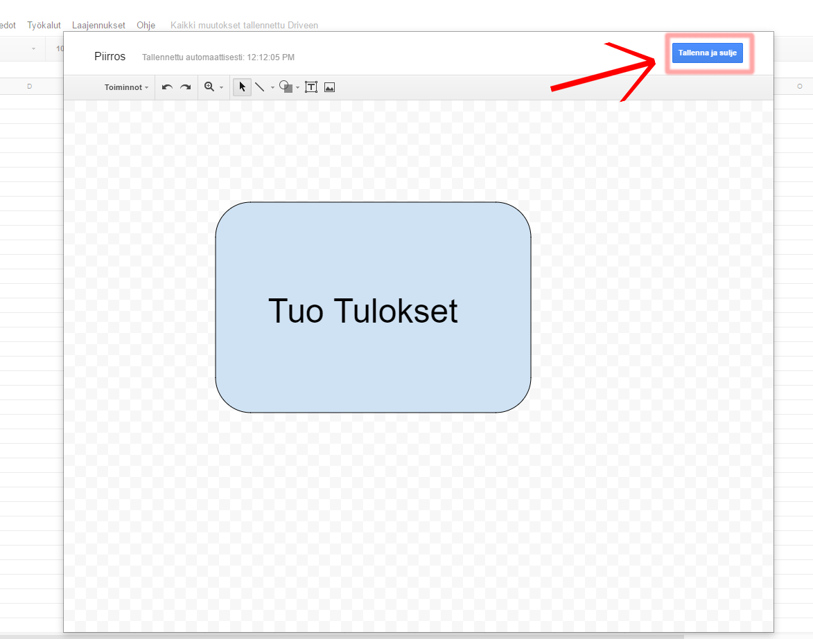

# Sääasema: DHT lämpötila-anturin BMP-paineanturin tietojen lähettäminen Gsheet-laskentataulukkoon

Jussi Roos ja Matti Heikkinen

## Kuvia

_DHT lämpötila- ja kosteusanturi, BMP paine ja lämpötila-anturi, Wemos mini d1 -mikrokontrolleri, joka on wifi-piirillä varustettu arduino- yhteensopiva kontrolleri._

_Kytkentä. Taulukossa on esitetty mitä portteja dht ja BMP käyttävät koodissa._

## Huomioita

Arduino koodiin pääset [tästä](https://pastebin.com/0ZAWRFm6)

Google Sheets skriptin koodiin pääset [tästä](https://pastebin.com/KY3DguiH)

Tietokoneen arduino-ohjelmointiympäristöön sinun on asennettava FirebaseArduino-kirjasto.

HUOMAUTUS 03.09.2017: Kirjaston tiedosto FirebaseHttpClient.h avain on vanhentunut. Kirjasto toimii jos muokkaat FirebaseHttpClient.h-tiedoston avaimen:

vanha: "9A E1 A3 B7 88 E0 C9 A3 3F 13 72 4E B5 CB C7 27 41 B2 0F 6A"

uusi: "B8 4F 40 70 0C 63 90 E0 07 E8 7D BD B4 11 D0 4A EA 9C 90 F6"

FirebaseArduino.h [https://github.com/firebase/firebase-arduino](https://github.com/firebase/firebase-arduino)

DHT.h [https://github.com/adafruit/DHT-sensor-library](https://github.com/adafruit/DHT-sensor-library)

MYeP8ZEEt1ylVDxS7uyg9plDOcoke7-2l

## Kytkennät

| WeMos | DHT | BMP |
|-------|-----|-----|
| GND   | DHT | BMP |
| 3V3   | 3V3 | 3V3 |
| D1    | -   | D1  |
| D2    | -   | D2  |
| D4    | D4  | -   |

## Ohjeet

1. Kytke DHT ja BMP anturit WeMokseen [kytkentätaulukon](#kytkennat) mukaisesti
2. Luo google firebase projekti osoitteessa [console.firebase.google.com](https://console.firebase.google.com/)
3. Kopioi Arduino koodi
4. Kopioi Firebasesta projektisi osoite ja liitä se Arduino koodiin muodossa jossa ei ole ollenkaan https:// alkua tai kautta viivaa lopussa

5. Mene takaisin firebaseen projektisi sivuille
6. Paina ratasta ja valitse “Project settings”

7. Paina “SERVICE ACCOUNTS”

8. Paina “Database Secrets”

9. Kopioi Secret key

10. Liitä secret key Arduino koodiin kuvassa esitettyyn kohtaan

11. Seuraavaksi täytä wifin tiedot

12. Nyt voit lähettää arduino koodin WeMokseen
13. Seuraavaksi luo uusi Google Sheets laskentataulukko
14. Paina “Työkalut”
15. Paina “Ohjelman muokkaustyökalu”

16. Kopioi Ohjelman muokkaus työkaluun koodi jonka saat [tästä](https://pastebin.com/KY3DguiH)
17. Mene takaisin google sheets tiedostoon ja kopioi tiedoston ID kuvan näyttämästä kohdasta URL palkilla

18. Liitä tiedoston id kuvan näyttämään kohtaan

19. Mene firebaseen projektisi sivulle ja paina “Database” (Punaisella kuvassa)
20. Kopioi projektisi URL osoite (Vihreällä kuvassa)

21. Mene takaisin google scriptiin
22. Liitä URL osoite kuvassa esitettyyn kohtaan

23. Mene takaisin firebaseen projektisi sivuille
24. Paina ratasta ja valitse “Project settings”

25. Paina “SERVICE ACCOUNTS”

26. Paina “Database Secrets”

27. Kopioi Secret key

28. Liitä secret key kuvassa esitettyyn kohtaan

29. Paina “Tiedosto”
30. Paina “Tallenna”

31. Seuraavaksi ohjelman muokkaus työkalu kysyy ohjelmalle nimeä\. Kirjoita kenttään “getAllData”
32. Paina “OK”

33. Kun ohjelman muokkaus työkalu aukeaa paina “Resurssit”
34. Paina “Kirjastot”

35. Kirjoita “Lisää kirjasto” kenttään seuraava koodi “MYeP8ZEEt1ylVDxS7uyg9plDOcoke7\-2l”
36. Paina “Lisää”

37. Paina “Versio” tekstin alla olevia kolmea pistettä
38. Valitse versioksi “11 Public release” \(Tämä on ohjeiden tekohetkellä uusin Public release mutta jos valikossa näkyy myös uudempi Public release voit valita myös sen\)
39. Paina “Tallenna”

40. Mene takaisin google sheets tiedostoon
41. Paina “Lisää”
42. Paina “Piirros”

_HUOM: Painonapin rakentaminen ei ole pakollinen. G Scriptin voi käydä päivittämässä manuaalisesti Gscript-editorissa (play näppäin)._

43. Piirrä haluamasi nappula
44. Paina “Tallenna”

45. Paina kuvan vieressä olevaa pientä nuolta
46. Paina “Määritä ohjelma”

47. Kirjoita kenttään “getAllData”
48. Paina “OK”

49. Paina seuraavaksi nappulaa ja odota hetki ja tulosten pitäisi ilmestyä

