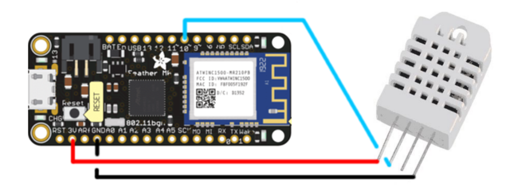

# DHT-lämpötilasensori + Google Sheets datankeräys ja -analyysi
Tämä ohjelma lukee DHT11 tai DHT22 sensorista lämpötiladataa, ja lähettää sen Google Sheettiin [IFTTT](https://ifttt.com/)-palvelun avulla.

## IFTTT
1. Luo IFTTT-tili.
2. Luo uusi Applet (yläkulmassa oleva profiilikuvake > New Applet).
3. Valitse _this_.
4. Kirjoita hakuun _Webhooks_ ja valitse ikoni jossa lukee _Webhooks_.
5. Valitse _Receive a web request_.
6. Anna tälle webhookille nimeksi `dht_to_sheet`.
7. Valitse _Create trigger_.
8. Valitse _that_.
9. Kirjoita hakuun _Google Sheets_ ja valitse ikoni jossa lukee _Google Sheets_.
10. Valitse _Add row to spreadsheet_.
11. Valitse _Create action_.
12. Siirry My Applets > Services > Webhooks > Settings
    (tai [klikkaa tästä](https://ifttt.com/services/maker_webhooks/settings))
    ja kopioi URL-kohdan viimeinen osa
    (`https://maker.ifttt.com/use/`:n jälkeen oleva sotku).

## Koodi
1. Kopioi projektin koodi [dht_temp_sensor_ifttt.ino](dht_temp_sensor_ifttt.ino) tiedostosta.
2. Korvaa kohta `IFTTT KEY` IFTTT-osion kohdassa 12 kopioidulla avaimella.
3. Korvaa kohdat `WIFIN SSID` ja `WIFIN SALASANA` jonkin käytettävissä olevan WiFin tiedoilla. Voit käyttää esimerkiksi kännykkääsi hotspottina.

## Rauta
Kiinnitä Feather M0 -arduinoosi DHT sensori\* seuraavasti:

\* DHT11 tai DHT22, liitännät ovat samat, vain väri ja laitteisto ovat erilaisia.
