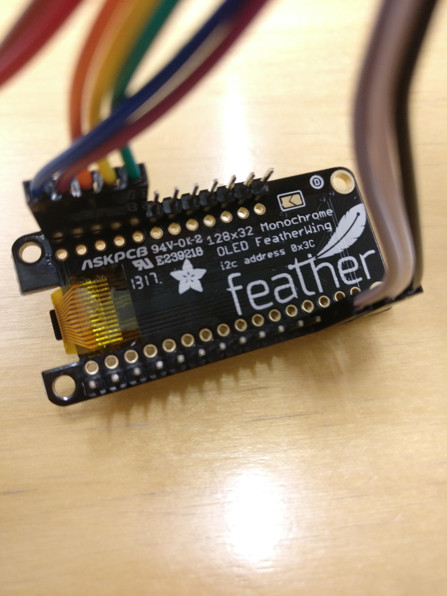

# Feather M0 SSD1306 128x32

---

Tämä on Feather M0 esimerkkiprojekti, jossa
kirjoitetaan SSD1306 128x32 Oled-näytölle.

## Tarvikkeet

Tarvitset seuraavat osat:

- Feather M0
- FeatherWing OLED SSD1306 128x32
- Jumppereita min. 4

## Kytkentä

FeatherWingin pinnit ovat samat kuin itse
Featherissa.
Tästä syystä FeatherWingissä ei ole
pin-merkintöjä.
Reset kytkentä ei ole pakollinen, ellet
halua FeatherWingin avulla käynnistää
Featheria uudestaan.

Kytkennät:

| Feather | FeatherWing |
| ------- | ----------- |
| GND     | GND         |
| 3V3     | 3V3         |
| RST     | (Reset) RST |
| SDA     | SDA         |
| SCL     | SCL         |

Lisäksi halutessasi, voit kytkeä
FeatherWingin napit:

| Feather | FeatherWing |
| ------- | ----------- |
| 5       | 5 (Nappi C) |
| 6       | 6 (Nappi B) |
| 9       | 9 (Nappi A) |

> Featherin päässä olevat kytkennät

> OLED FeatherWingin päässä olevat kytkennät

### Kytkentäkaavio

