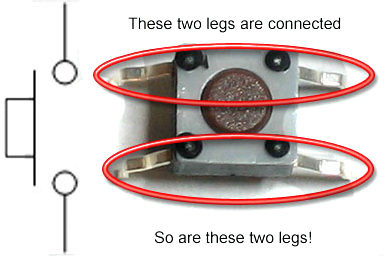

# Gamepad
Raspberry Pi-osuuden löydät [täältä]()!

## Yhteenveto
Tämä on Arduino-peliohjaimen Arduino-osuus ja dokumentaatio sen
rakentamiselle.

Tämän projektin tarkoitus on opettaa yksinkertaisen sarjaliikenteen perusteet.

Tässä kansiossa on vain ohjeet ja valmiit arduino-koodit.
Tarvitset myös [sarjaliikenteen kuuntelijan]().

## Tarvittavat osat
- Arduino & USB-johto
- Kytkentäalusta
- Jotain seuraavista:
    - Nappeja
    - Joystickeja
- 1KΩ – 1MΩ vastuksia
- Hyppylankoja

## Ohjeet
> **Huomaa**: ohjeet eivät ole tarkasti tiettyä konfiguraatiota varten,
> vaan ohjeet pääosin selittävät miten osia yhdistetään.
> Hyödynnä ohjeita osiesi ja osaamisesi mukaan!

### Näin kytket ja ohjelmoit napin

> Digitaalisia kaksiasentoisia nappeja


> 4-jalkainen nappi
- kun painat napista, niin kaikki napin jalat muodostavat yhteisen kytkennän


> 4-jalkaisen napin kytkentäkaavio
- nappi kytketään alustaan keskelle
> Vaaleansininen ja keltainen johto kuljettavat identtistä signaalia!

---
- 2-jalkaisten nappien jalat muodostavat kytkennän napin painalluksesta.

Napeille on oleellista olla *alasvetovastus*, jotta napin mittauskannan
(jossa kaaviossa on vaaleansininen johto) potentiaali on aina joko 5V (päällä)
tai 0V (pois päältä) eikä jää ns. kellumaan välille. Jos vastus on liian pieni
tai vastuksen tilalla on johto, niin napin painallus aiheuttaa oikosulun
Arduinon virtalähteeseen.

> Tällainen oikosulku ei vaurioita itse Arduinoa

##### Arduinon ohjelmointi
4-jalkaiset ja 2-jalkaiset napit käyttäytyvät identtisesti koodin näkökulmasta

Määritellään napin mittauskannan pinni
```cpp
#define NAPPI1 [napin pinnin numero]
```

> Rivi ei ollut arduino-koodia vaan macro-määritelmä, sen takia rivin loppuun
> ei tule `;`-merkkiä

Määritellään napin pinnin numero Arduinon `setup`-*rutiinissa* syötteeksi
```cpp
pinMode(NAPPI1, INPUT);
```

Digitaalisen signaalin syötettä voidaan hakea funktiolla
```cpp
digitalRead(NAPPI1);
```
> Syötettä voidaan esimerkiksi hakea jatkuvasti `loop`-*rutiinin* sisällä

### Näin kytket joystickin

> Joystick, jossa on kaksi potentiometriä ja yksi nappi

## Esimerkki
