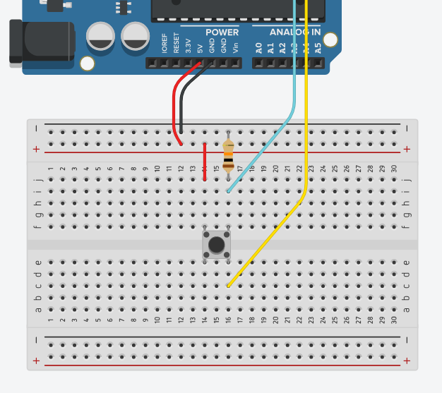

# Gamepad
Raspberry Pi-osuuden löydät [täältä](https://github.com/Pohjois-Tapiolan-lukio/raspberry_pi-projects/tree/master/projects/gamepad)!

## Yhteenveto
Tämä on Arduino-peliohjaimen Arduino-osuus ja dokumentaatio sen
rakentamiselle.

Tämän projektin tarkoitus on opettaa yksinkertaisen sarjaliikenteen perusteet.

Samanlaista gamepadia olisi epäkäytännöllistä rakentaa suoraan Raspberry Pi:hin,
sillä se vaatisi ADC (Analog to Digital Converetr) laitteistoa.
Jotta analoginen data saadaan Raspberry Pi:lle, täytyy tehdä ulkoinen laite ja
keskustelu-protokolla.

Tässä kansiossa on vain ohjeet ja valmiit esimerkki Arduino-koodit.
Tarvitset myös [sarjaliikenteen kuuntelijan](https://github.com/Pohjois-Tapiolan-lukio/raspberry_pi-projects/tree/master/projects/gamepad),
joka lukee ja tulkitsee Arduinon syötettä.

## Tarvittavat osat
- Arduino & USB-johto
- Kytkentäalusta
- Jotain seuraavista:
    - Nappeja
    - Joystickeja
- 1KΩ – 1MΩ vastuksia
- Hyppylankoja

## Ohjeet
> **Huomaa**: ohjeet eivät ole tarkasti tiettyä konfiguraatiota varten,
> vaan ohjeet pääosin selittävät miten osia yhdistetään.
> Hyödynnä ohjeita osiesi ja osaamisesi mukaan!

### Näin kytket ja ohjelmoit napin

> Digitaalisia kaksiasentoisia nappeja


> 4-jalkainen nappi
- kun painat napista, niin kaikki napin jalat muodostavat yhteisen kytkennän


> 4-jalkaisen napin kytkentäkaavio
- nappi kytketään alustaan keskelle
> Vaaleansininen ja keltainen johto kuljettavat identtistä signaalia!

---
- 2-jalkaisten nappien jalat muodostavat kytkennän napin painalluksesta.

Napeille on oleellista olla *alasvetovastus*, jotta napin mittauskannan
(jossa kaaviossa on vaaleansininen johto) potentiaali on aina joko 5V (päällä)
tai 0V (pois päältä) eikä jää ns. kellumaan välille. Jos vastus on liian pieni
tai vastuksen tilalla on johto, niin napin painallus aiheuttaa oikosulun
Arduinon virtalähteeseen.

> Tällainen oikosulku ei vaurioita itse Arduinoa eikä luultavasti virtalähdettä

#### Arduinon ohjelmointi
4-jalkaiset ja 2-jalkaiset napit käyttäytyvät identtisesti koodin näkökulmasta

Määritellään napin mittauskannan pinni
```cpp
#define NAPPI1 [napin pinnin numero]
```

> Rivi ei ollut arduino-koodia vaan macro-määritelmä, sen takia rivin loppuun
> ei tule `;`-merkkiä

Määritellään napin pinnin numero Arduinon `setup`-*rutiinissa* syötteeksi
```cpp
pinMode(NAPPI1, INPUT);
```

Digitaalisen signaalin syötettä voidaan hakea funktiolla `digitalRead()`,
joka palauttaa `int` (kokonaisluku) -arvon `0` tai `1`
> Vaikka palautusarvo on `int`, voit tallentaa sen `bool` (binääri) -arvona,
> koska Arduino tekee automaattisen tyyppimuunnoksen `int` ja `bool` välillä,
> jos niiden arvona on `0` tai `1`

```cpp
digitalRead(NAPPI1);
```
> Syötettä voidaan hakea jatkuvasti `loop`-*rutiinin* sisällä

### Näin kytket joystickin

> Joystick, jossa on kaksi potentiometriä ja yksi nappi


> Johtojen värit:
> - Punainen: VCC (5V)
> - Sininen: Vertikaalisen asennon potentiometri (ylöspäin -> VCC)
> - Vihreä: Horisontaalisen asennon potentiometri (vasemmalle -> VCC)
> - Valkoinen: Tattinappi (painettu -> 0V)
> - Musta: GND (0V)

Määritellään joystickin ja napin mittauskantojen pinnit
```cpp
#define JOYSTICK_X [joystickin horisontaalisen potentiometrin pinni]
#define JOYSTICK_Y [joystickin vertikaalisen potentiometrin pinni]
#define JOYSTICK_THUMB [joystickin napin pinni]
```

Määritellään joystickin napin pinnin numero
Arduinon `setup`-*rutiinissa* syötteeksi
> Analogisia pinnejä ei tarvitse määritellä, koska ne on jo valmiiksi
> syötteitä
```cpp
pinMode(JOYSTICK_THUMB, INPUT);
```

Signaalienn syötettä voidaan hakea funktioilla `analogRead()`,
joka palauttaa `int` (kokonaisluku) -arvon välillä 0 – 1023
```cpp
analogRead(JOYSTICK_X);
analogRead(JOYSTICK_Y);
digitalRead(JOYSTICK_THUMB);
```

## Sarjaliikenteen ohjelmointi
Tätä varten tarvitaan Serial, joka initialisoidaan `setup`:ssa
```cpp
Serial.begin(9600);
```
> 9600 tarkoittaa sarjaliikenteen symbolinopeutta.
> Sen muuttamiselle ei ole tarvetta yksinkertaisessa
> kommunikoinnissa

Arvot voidaan kirjoittaa sarjaliikenteeseen `\r\n` (rivinvaihto)
-merkkijonolla erotettuina funktiolla `Serial.println`
```cpp
Serial.println(arvo);
```

Esim:
```cpp
int joystick1X = analogRead(JOYSTICK1_X);
Serial.println(joystick1X);
```

> Esimerkkikoodi, joka lukee yhtä joystickin akselia löydät
> [täältä](joystick/joystick.ino)

Kun olet lähettänyt ohjelman Arduinolle, voit avata
sarjaliikennemonitorin `Tools`-valikon alta nähdäksesi
sarjaliikenteessä tulevat viestit.

## <a name="koodi"></a> Datan <i>koodaus<i/>

Jotta sarjaliikenteen data voidaan lukea, sillä täytyy olla
jonkinlainen *formaatti* eli *koodi*

Formaatti voi olla esimerkiksi:
- `[luku1],[luku2],[luku3]`, eli luvut peräkkäin pilkulla erotettuna
> Tämä on yksinkertaisin toimiva ratkaisu
- `luku1:[luku1],luku2:[luku2],luku2:[luku2]`, eli avain-arvo
pareja pilkulla erotettuna
> Tämän etuna on se, että ihmisen on helpompi lukea dataa
- `[luku1hex{N}][luku2hex{N}][luku3hex{N}]`, eli luvut muutettuina
heksadesimaaliin ja padättyinä nollilla merkkijonojen maksimipituuteen *N*
> esim luvut 123, 4095, 515, N=3 -> 07BFFF203 <br/>
> Tämän *informaatiotiheys* on suurempi
> <br/>
> **Haastetta haluaville suosittelen keksimään jonkun oman formaatin**

---
Koodaus toteutetaan itse Arduino-koodissa `String`-objekteja lisäämällä (helppo)
tai manuaalisesti manipuloimalla muistia (vaikeampi)

Yllä olevat formaatit voidaan toteuttaa esimerkiksi koodeilla:

> `[luku1],[luku2],[luku3]`, eli luvut peräkkäin pilkulla erotettuna

```cpp
int luku1, luku2, luku3;
/* lukujen asettaminen... */
Serial.println(
    String(luku1) + "," +
    String(luku2) + "," +
    String(luku3));
```
> `luku1:[luku1],luku2:[luku2],luku2:[luku2]`, eli avain-arvo
> pareja pilkulla erotettuna
<br/>
```cpp
int luku1, luku2, luku3;
/* lukujen asettaminen... */
Serial.println(
    "luku1:" + String(luku1) + "," +
    "luku2:" + String(luku2) + "," +
    "luku3:" + String(luku3));
```
> `[luku1hex{N}][luku2hex{N}][luku3hex{N}]`, eli luvut muutettuina
> heksadesimaaliin ja padättyniä nollilla lukujen maksimipituuteen *N*
<br/>
```cpp
int arvot[] = {123,4095,515};

int const len = 3;
char tmp[len+1], tmp2[10];
for (int i=0; i<sizeof(arvot)/sizeof(arvot[0]); ++i){
    sprintf(tmp2, "%%.%dX", len);
    sprintf(tmp, tmp2, arvot[i]);
    Serial.print(tmp);
}
Serial.println();
```

<br/>
> **Huomaa:** `Serial.println` tulostaa merkkijonon loppuun `\r\n`, joka
> tarkoittaa, että rivin loppuun tulee rivinvaihto.
> Sillä on merkitystä kuuntelijan puolen [dekoodauksessa](https://github.com/Pohjois-Tapiolan-lukio/raspberry_pi-projects/tree/master/projects/gamepad#python-dekoodaus)

## Esimerkkiohjelmat
Esimerkkiohelmassa [gamepad.ino](gamepad/gamepad.ino) on kahden
joystickin ja 3 napin ohjelma.

Esimerkkiohjelmassa [joystick.ino](joystick/joystick.ino) on yksinkertainen
yhden joystickin akselin ohjelma.

