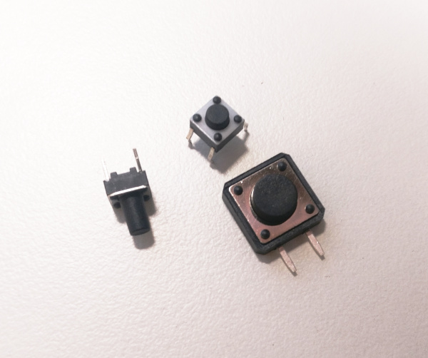

# Gamepad
Raspberry Pi-osuuden löydät [täältä]()!

## Yhteenveto
Tämä on Arduino-peliohjaimen Arduino-osuus ja dokumentaatio sen
rakentamiselle.

Tämän projektin tarkoitus on opettaa yksinkertaisen sarjaliikenteen perusteet.

Tässä kansiossa on vain ohjeet ja valmiit arduino-koodit.
Tarvitset myös [sarjaliikenteen kuuntelijan]().

## Tarvittavat osat
- Arduino & USB-johto
- Kytkentäalusta
- Jotain seuraavista:
    - Nappeja
    - Joystickeja
- 1KΩ – 1MΩ vastuksia
- Hyppylankoja

## Ohjeet
> **Huomaa**: ohjeet eivät ole tarkasti tiettyä konfiguraatiota varten,
> vaan ohjeet pääosin selittävät miten osia yhdistetään.
> Hyödynnä ohjeita osiesi ja osaamisesi mukaan!

### Näin kytket ja ohjelmoit napin

> Digitaalisia kaksiasentoisia nappeja


> 4-jalkainen nappi
- kun painat napista, niin kaikki napin jalat muodostavat yhteisen kytkennän


> 4-jalkaisen napin kytkentäkaavio
- nappi kytketään alustaan keskelle
> Vaaleansininen ja keltainen johto kuljettavat identtistä signaalia!

---
- 2-jalkaisten nappien jalat muodostavat kytkennän napin painalluksesta.

Napeille on oleellista olla *alasvetovastus*, jotta napin mittauskannan
(jossa kaaviossa on vaaleansininen johto) potentiaali on aina joko 5V (päällä)
tai 0V (pois päältä) eikä jää ns. kellumaan välille. Jos vastus on liian pieni
tai vastuksen tilalla on johto, niin napin painallus aiheuttaa oikosulun
Arduinon virtalähteeseen.

> Tällainen oikosulku ei vaurioita itse Arduinoa

##### Arduinon ohjelmointi
4-jalkaiset ja 2-jalkaiset napit käyttäytyvät identtisesti koodin näkökulmasta

Määritellään napin mittauskannan pinni
```cpp
#define NAPPI1 [napin pinnin numero]
```

> Rivi ei ollut arduino-koodia vaan macro-määritelmä, sen takia rivin loppuun
> ei tule `;`-merkkiä

Määritellään napin pinnin numero Arduinon `setup`-*rutiinissa* syötteeksi
```cpp
pinMode(NAPPI1, INPUT);
```

Digitaalisen signaalin syötettä voidaan hakea funktiolla
```cpp
digitalRead(NAPPI1);
```
Syötettä voidaan hakea jatkuvasti `loop`-*rutiinin* sisällä,
ja se voidaan myös kirjoittaa sarjaliikenteeseen `\r\n` (rivinvaihdon merkit)
-merkkijonolla erotettuina funktiolla `Serial.println`
```cpp
int arvo1 = digitalRead(NAPPI1);
Serial.println(arvo1);
```
Tätä varten tarvitaan Serial, joka initialisoidaan `setup`:ssa
```cpp
Serial.begin(9600);
```

Kun olet lähettänyt ohjelman Arduinolle, voit avata
sarjaliikennemonitorin `Tools`-valikon alta nähdäksesi
sarjaliikenteessä tulevat viestit.

> 9600 tarkoittaa sarjaliikenteen symbolinopeutta.
> Sen muuttamiselle ei yleensä ole tarvetta yksinkertaisessa
> kommunikoinnissa

Yllä on kaikki mitä tarvitsee yksinkertaisen yksisuuntaisen
sarjaliikenteen luomiseksi

### Näin kytket joystickin

> Joystick, jossa on kaksi potentiometriä ja yksi nappi

## Koodaus (ei ohjelmointi)

Jotta sarjaliikenteen data voidaan lukea, sillä täytyy olla
jonkinlainen *formaatti*

Formaatti voi olla esimerkiksi:
- \[luku1\],\[luku2\],\[luku3\], eli luvut peräkkäin pilkulla erotettuna
- luku1:\[luku1\],luku2:\[luku2\],luku2:\[luku2\], eli avain-arvo
pareja pilkulla erotettuna
- \[luku1hex{N}\]\[luku2hex{N}\]\[luku3hex{N}\], eli luvut muutettuina
heksadesimaaliin ja padättyinä nollilla merkkijonojen maksimipituuteen *N*
> esim luvut 123, 4095, 515, N=3 -> 07BFFF203

Mutta suosittelen keksimään jonkun oman formaatin

---
Koodaus toteutetaan Arduino-koodissa `String`-objekteja lisäämällä (helppo)
tai manuaalisesti manipuloimalla muistia (vaikeampi)

Yllä olevat formaatit voidaan toteuttaa esimerkiksi:
- \[luku1\],\[luku2\],\[luku3\], eli luvut peräkkäin pilkulla erotettuna

```cpp
int luku1, luku2, luku3;
/* lukujen asettaminen... */
Serial.println(
    String(luku1) + "," +
    String(luku2) + "," +
    String(luku3));
```
- luku1:\[luku1\],luku2:\[luku2\],luku2:\[luku2\], eli avain-arvo
pareja pilkulla erotettuna

```cpp
int luku1, luku2, luku3;
/* lukujen asettaminen... */
Serial.println(
    "luku1:" + String(luku1) + "," +
    "luku2:" + String(luku2) + "," +
    "luku3:" + String(luku3));
```
- \[luku1hex{N}\]\[luku2hex{N}\]\[luku3hex{N}\], eli luvut muutettuina
108 heksadesimaaliin ja padättyniä nollilla lukujen maksimipituuteen *N*

```cpp
int arvot[] = {123,4095,515};

int const len = 3;
char tmp[len+1], tmp2[10];
for (int i=0; i<sizeof(arvot)/sizeof(arvot[0]); ++i){
    sprintf(tmp2, "%%.%dX", len);
    sprintf(tmp, tmp2, arvot[i]);
    Serial.print(tmp);
}
Serial.println();
```

> **Huomaa:** `Serial.println` tulostaa merkkijonon loppuun `\r\n`, joka
> tarkoittaa, että loppuun tulee rivinvaihto.
> Sillä on merkitystä kuuntelijan puolen [koodissa]()

## Esimerkki
[Esimerkki 1]()
