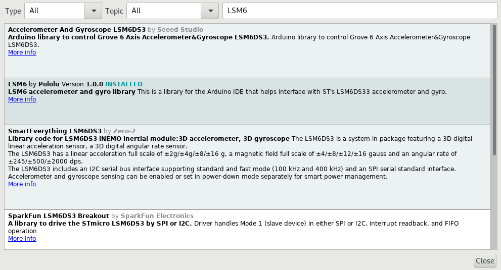
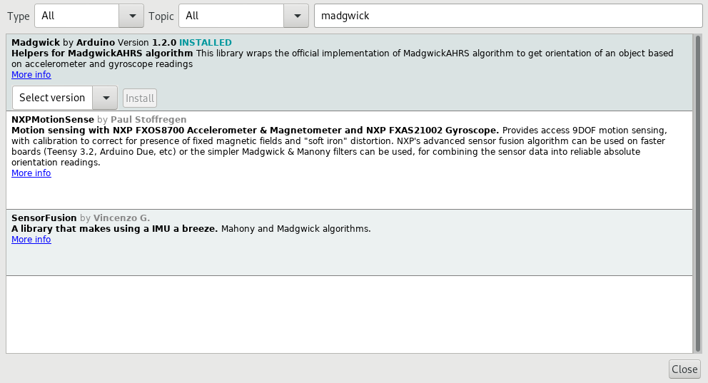

# LSM6 Esimerkkejä

## Tiedostot

- [LSM6Simple.ino](LSM6Simple.ino) on kooditiedosto, jossa
  lasketaan LSM6-_imu_:lla nyökkäys ja kallistus käyttäen
  pelkästään akselerometria
- [LSM6AHRS.ino](LSM6AHRS.ino):ssa lasketaan suunta, nyökkäys ja kallistus
  kvaternioilla. Tämä metodissa käyttää sekä akselerometria, että gyroskooppia

## Kirjastot

Molempia esimerkkejä varten tarvitset:

- `LSM6` kirjaston. Mene `Tools > Manage Libraries...`, ja kirjoita sinne `LSM6`
  
- [LSM6Simple.ino](LSM6Simple.ino):ssa et tarvitse muuta
- [LSM6AHRS.ino](LSM6AHRS.ino):a varten tarvitset _MadgwickAHRS_-kirjaston,
  jonka saa myös kirjastomanagerista
  

## Kytkentäkaavio

