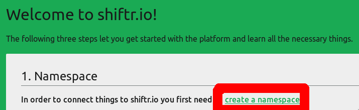
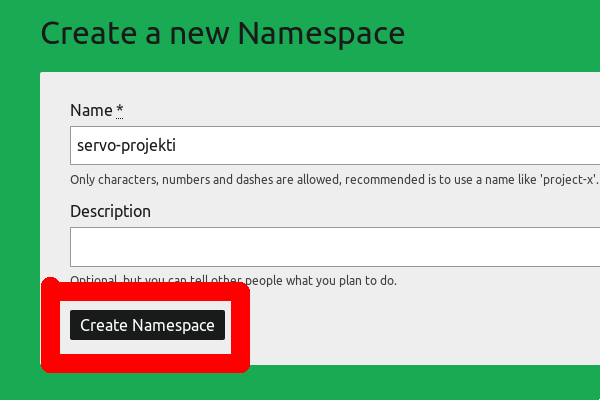
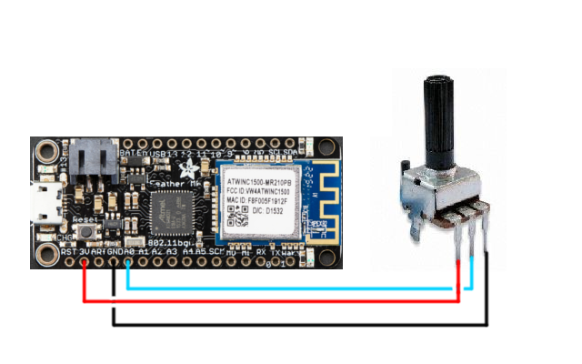
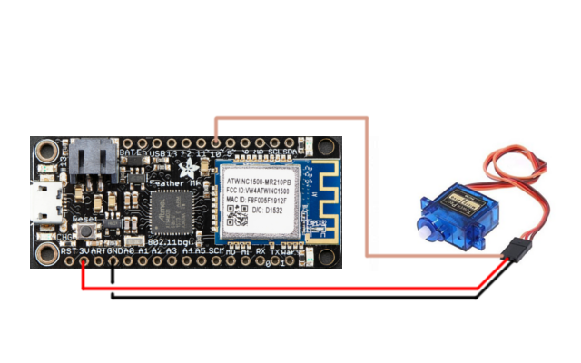

# Shiftr.io ohje

## Shiftr.io tilin luominen
1. Mene [Shiftr.io](https://shiftr.io):n sivuille, ja klikkaa "Sign up for free."

   

2. Luo tili omilla tiedoillasi.

   

## Shiftr.io namespacen luominen
3. Auenneessa sivussa voit luoda uuden nimiavaruuden.

   

4. Anna nimiavaruudellesi jokin nimi, esimerkiksi "servo-projekti."

   

5. Klikkaa "Namespace Settings."

   

6. Klikkaa "Add token."

   

7. Luo uusi token, jätä oletusnimet päälle.

   

8. Avaa yläkulmasta "Dashboard."

   

9. Ruudulla näkyvälle tyhjälle alueelle ilmestyy ohjeen seuraavissa osissa lisättävät IoT-laitteet, joten kannattaa jättää tämä sivu auki taustalle kun jatkat eteenpäin.

   

## Rauta
Jotta voit siirtää koodit Adafruit Feather M0:n (Arduinon kaltaiset mikrokontrollerit joita tähän työhön käytetään), pitää asentaa kaksi asiaa Board Managerista.

1. Lisää seuraava URL Arduinon asetuksissa (File -> Preferences) olevaan "Additional Boards Manager URLs" kohtaan: https://adafruit.github.io/arduino-board-index/package_adafruit_index.json
2. Etsi Board Managerista (Tools -> Board -> Board Manager) SAMD, ja asenna Arduinon ja Adafruitin boardit.
3. Valitse boardiksesi Adafruit Feather M0.
4. Lisää (Sketch -> Include Library -> Manage Libraries) kaksi kirjastoa: Wifi101 (Arduino) ja MQTT (Joel Gaehwiler)

---

1. Ensimmäiseen Featheriin kiinnitä potentiometri, ja siirrä Featheriin koodi\* täältä: https://github.com/Pohjois-Tapiolan-lukio/arduino-projects/blob/master/shiftr_from_analog/shiftr_from_analog.ino
   - Liitännät:

     
2. Toiseen Featheriin kiinnitä servo, ja siirrä Featheriin koodi\* täältä: https://github.com/Pohjois-Tapiolan-lukio/arduino-projects/blob/master/shiftr_to_servo/shiftr_to_servo.ino
   - Liitännät:

     

\* Koodissa pitää vaihtaa seuraavat kohdat koodin alussa:
- `<WIFI NIMI>` on jonkin WiFi verkon nimi. (Voit käyttää esimerkiksi kännykän hotspottia)
- `<WIFI SALASANA>` on WiFi verkon salasana.
- `<LAITTEEN NIMI>` voi olla mikä tahansa, tämä on se tekstinpätkä joka näkyy laitteen päällä visualisaatiossa, joka näytettiin aiemmin kohdassa 9. Esim. "sensori" tai "servo"
- `<SHIFTR TOKEN ENSIMMÄINEN OSA>` on ensimmäinen osa tokenia, alleviivattu sinisellä kohdan 8 kuvassa.
- `<SHIFTR TOKEN TOINEN OSA>` on toinen osa tokenia, alleviivattu keltaisella kohdan 8 kuvassa.
