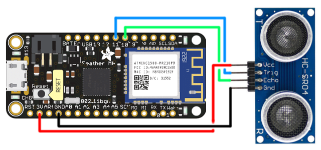

# Etäisyysmittari + Blynk
Tässä projektissa luodaan etäisyysmittari joka lähettää dataa kännykässä olevaan Blynk-sovellukseen.

## Blynk
/// TODO: Kirjoita Blynkille rekisteröitymis- ja käyttöohje

## Rauta
### Feather M0
Jotta voit siirtää koodit Adafruit Feather M0:n (Arduinon kaltaiset mikrokontrollerit joita tähän työhön käytetään), pitää asentaa kaksi asiaa Board Managerista.

1. Lisää seuraava URL Arduinon asetuksissa (File -> Preferences) olevaan "Additional Boards Manager URLs" kohtaan: `https://adafruit.github.io/arduino-board-index/package_adafruit_index.json`
2. Etsi Board Managerista (Tools -> Board -> Board Manager) SAMD, ja asenna Arduinon ja Adafruitin boardit. (Yleensä nämä ovat ylin ja alin vaihtoehto)
3. Valitse boardiksesi Adafruit Feather M0. (Tools -> Board -> Adafruit Feather M0)

### Liitännät

## Koodi
1. Lisää kaksi kirjastoa: WiFi101 (Arduino) ja Blynk (Volodymyr Shymanskyy)

   (Sketch -> Include Library -> Manage Libraries)
2. Kopioi koodi tiedostosta [`ultrasonic_blynk.ino`](ultasonic_blynk.ino) Arduino-koodieditoriin.
3. Korvaa `WIFI SSID` ja `WIFI PASS` WiFisi tiedoilla. Voit käyttää esimerkiksi puhelintasi hotspottina.
4. Korvaa `BLYNK AUTH` [Blynk](#blynk)-osion kohdassa N kopioidulla koodilla.
   /// TODO: Korvaa ylempi "N".
