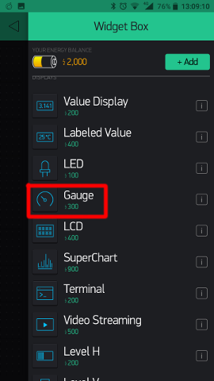
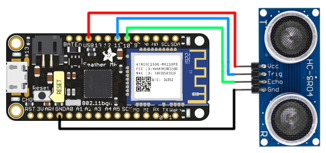

# Etäisyysmittari + Blynk
Tässä projektissa luodaan etäisyysmittari joka lähettää dataa kännykässä olevaan Blynk-sovellukseen.

## Blynk
1. Asenna Blynk-sovellus älypuhelimesi Google Playsta tai App Storesta.
2. Valitse "Create new account."
3. Kirjoita emailisi (oikea email, jonka voit avata kohdassa 9) ja salasanasi (pistä muistiin) ja valitse "Sign Up."
4. Valitse "Cool, got it."
5. Valitse "New Project."
6. Anna projektille jokin nimi, esimerkiksi "etäisyysmittari."
7. Valitse ESP8266 tilalle "Generic Board."
8. Valitse "Create." Blynk saattaa kertoa, että sähköpostiisi on lähetetty auth token. Jatka eteenpäin.
9. Avaa e-mailisi, etsi viesti jonka otsikko on jotakuinkin "Auth Token for etäisyysmittari project and device etäisyysmittari" ja kopioi sen sisältä löytyvä token, eli pitkä merkkijono joka koostuu satunnaisista numeroista ja kirjaimista. Kopioi tämä / pistä muistiin.
10. Luodaan nyt Blynkkiin widgetti joka tulee näyttämään etäisyyden. Valitse kuvassa korostettua "+"-nappi.

    
11. Valitse listasta "Gauge."

    
12. Valitse "Gauge" muokataksesi sitä.

    
13. Vaihda kuvassa vihreällä korostettu numero 1023:sta 100:n (koska etäisyysmittarimme ei edes pysty yli 100 cm mittauksiin, tämä on Gaugen yläraja).

    Paina sinisellä korostettua symbolia, tummana olleen symbolin pitäisi kirkastua. Tämä mahdollistaa desimaalilukujen näyttämisen (ja Arduino-koodimme vaatii sen).

    Viimeisenä, valitse punaisella korostettu "PIN" kohta.

    
14. Valitse piniksi Virtual V1.

    
15. Palaa widget-näkymään.

    
16. Valitse "play"-nappi käynnistääksesi widgetit.

    

## Rauta
### Feather M0
Jotta voit siirtää koodit Adafruit Feather M0:n (Arduinon kaltaiset mikrokontrollerit joita tähän työhön käytetään), pitää asentaa kaksi asiaa Board Managerista.

1. Lisää seuraava URL Arduinon asetuksissa (File -> Preferences) olevaan "Additional Boards Manager URLs" kohtaan: `https://adafruit.github.io/arduino-board-index/package_adafruit_index.json`
2. Etsi Board Managerista (Tools -> Board -> Board Manager) SAMD, ja asenna Arduinon ja Adafruitin boardit. (Yleensä nämä ovat ylin ja alin vaihtoehto)
3. Valitse boardiksesi Adafruit Feather M0. (Tools -> Board -> Adafruit Feather M0)

### Liitännät

## Koodi
1. Lisää kaksi kirjastoa: WiFi101 (Arduino) ja Blynk (Volodymyr Shymanskyy)

   (Sketch -> Include Library -> Manage Libraries)
2. Kopioi koodi tiedostosta [`ultrasonic_blynk.ino`](ultasonic_blynk.ino) Arduino-koodieditoriin.
3. Korvaa `WIFI SSID` ja `WIFI PASS` Wifisi asetuksilla. Voit käyttää esimerkiksi puhelintasi hotspottina.
4. Korvaa `BLYNK AUTH` [Blynk](#blynk)-osion kohdassa 10 kopioidulla koodilla.
